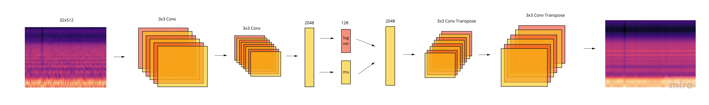
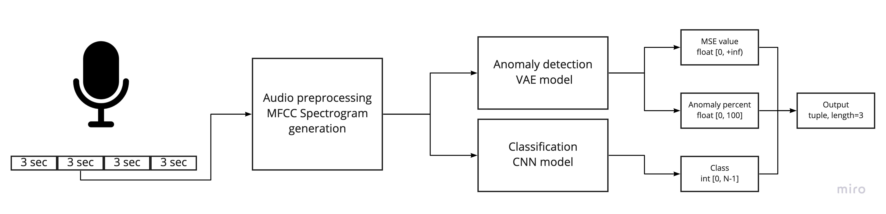

# Audio data anomaly detection system. For different types of engines.
### Variational Auto Encoder based ML model for anomaly detection in audio stream.

## Data
I used torchaudio for loading and processing wav files. It's usually 30 minutes long two-channeled wav files. As input to model used a MFCC spectrograms of 3 seconds long chunks.

## Models

### Anomaly detection
For anomaly detection used a VAE-based models. **Base VAE** model with 36118561 parametes and **VAE-light** model with  15857089 parameters.

VAE trained only on normal data restore the spectrogram. The spectrogram restores as if it's typical engines work, but saves the unique artifacts of these sample. And after we calculate MSE between input and output. If it is more than previously set threshold it's probably anomaly. 
### Classification
CNN based model with linear output.

## Usage
Repository contains:
* train script `run.py` 
* data generation script `data_generation.py` 
* ONNX exporting scripts `tools/to_onnx.py` and `tools/to_oX.py`
* visualization script `tools/gener.py`

### To run scripts:
* First `pip install -r requirements.txt`
* Set the config parameters. Description and data types in base config file `configs/conf.cfg`
* Run need script, e.g. `python run.py -c configs/conf.py`

## Inference

Script  `inference.py` get the audio in bytes format as input. Returns class and anomaly score.

